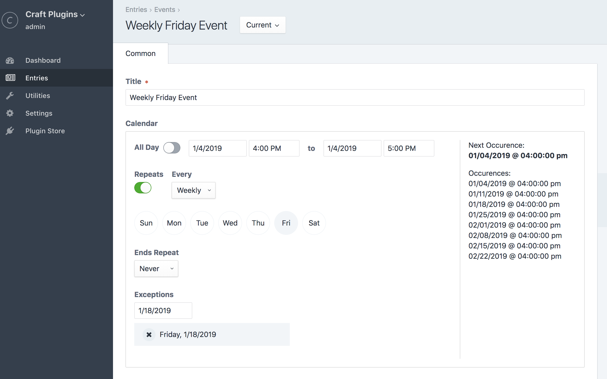

# Calendarize Field Type plugin for Craft CMS 3.x
This plugin adds a calendarize field type that provides an interface to have repeating dates just like on a calendar interface. Repeat daily, weekly, and monthly with multiple other configurations per repeat type. Also comes with the ability add exception dates.

## Requirements

This plugin requires Craft CMS 3.0.0-beta.23 or later and PHP7+.

## Installation

To install the plugin, follow these instructions.

1. Open your terminal and go to your Craft project:

        cd /path/to/project

2. Then tell Composer to load the plugin:

        composer require unionco/calendarize

3. In the Control Panel, go to Settings → Plugins and click the “Install” button for Calendarize.

## Calendarize Overview

Configuration is as follows:
1. Start Date - Datetime field
2. End Date - Datetime field
3. All Day - Lightswitch
4. Repeats - Lightswitch
5. Repeat Type - Dropdown [Daily, Weekly, Monthly]
6. Week Selector - Checkboxes
7. Monthly Selector - Dropdown [On the date, On the weekday of month]
8. Repeat Ends - Dropdown [Never, On Date]
9. Repeat End Date - Datetime field
10. Exceptions - Date fields Repeater (custom)

## Using Calendarize

In your twig templates you can access the calendarize field as you would with any other field.

1. Normal sub field access

        {{ event.calendarizeHandle.startDate.format('Y-m-d') }}
        {{ event.calendarizeHandle.repeats }}
        ...

2. Added functionality

        {{ event.calendarizeHandle.next.format('Y-m-d') }} // next occurence
        {{ event.calendarizeHandle.ends }} // boolean if it ends on date
        {{ event.calendarizeHandle.readable }} // readable string of the occurence
        
3. RRule functionality

        {{ event.calendarizeHandle.rrule }} 
        {{ event.calendatizeHandle.getOccurences(limit) }}
        {{ event.calendatizeHandle.getOccurrencesBetween(start, end, limit) }}

This plugin leverages the use of the PHP RRule library. Docs for this can be found here [PHP RRule](https://github.com/rlanvin/php-rrule). The `rrule` method returns the pre configured rrule with all its available methods. In addition, the `getOccurences` method returns all occurences of the entry with a `limit` of 10 by default and the `getOccurrencesBetween` returns the occurence between 2 dates. If the end date is null, it will not enforce the end date and give all occurence greater than the start date provided.

## Calendarize Roadmap

Open to adding features as needed.

Brought to you by [Franco Valdes](https://union.co)